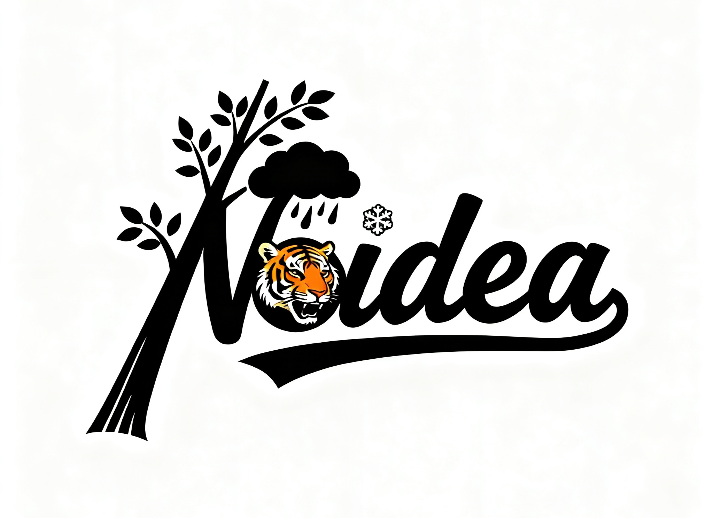

	<h1><em>Noidea</em></h1>
	「我真没招了」 软件工程小组主页

---

## :notes: 团队 Logo

### :books: 设计理念

1. 雨：元素中的“云”和“雨滴”代表了“雨”这一成员的名字特色，象征着变幻的天气和自然的变化，给人一种轻盈而自由的感觉。

2. 森：Logo中的树枝和叶子代表了“森”，象征着自然、生命和生长。树木的延伸和枝叶的繁茂体现了丰富的创造力和生命力。

3. 笑面虎：虎头部分直接反映了“笑面虎”的网名特色。虎是强大的动物，象征着力量和勇气，而笑面虎的形象则在强大中透露出一丝亲切和幽默，传递了小组成员积极乐观的态度。

4. 雪阳：雪花和雪滴的元素代表了“雪阳”，这一设计呼应了名字中的“雪”，传递出冷静、清新、静谧的感觉。而雪阳也代表着一种纯净与不受污染的意境，带有一种温暖的阳光氛围。

5. No idea：作为主元素，“No idea”使用了简洁明快的字体，传达出团队的创造力和对未知的探索精神。整个字体设计的流畅感象征了思维的自由与无拘无束，符合团队追求创新和突破的理念。

总的来说，这个设计以自然、力量、幽默和创造力为主题，通过巧妙结合每个成员的特色，形成一个有趣且富有象征意义的整体。

### :ledger: 生成过程

1. 字母造型与核心元素融合：先把🐯嵌入字母 “o”，同时保证 “Noidea” 字样清晰可辨。
2. 单个字母元素替换：依次对不同字母进行元素替换，把字母 “N” 的上方添加🌧️元素；将字母 “i” 的点替换成❄️；把字母 “N” 结合🌳元素进行设计，且是像替换 “i” 的点为❄️那样，将🌳元素融入字母里。
3. 背景与整体协调调整：把背景换成白色，让整体视觉更简洁，同时确保添加或替换的元素（🐯、🌧️、❄️、🌳等）与字母及整体设计风格协调统一。

---

## :star2: 团队介绍
- 团队名称：我真没招了
- 班级/课程：软件工程（202501）—— 指导教师：吴越钟
- 团队成员：
  - 成员 陈琨辉（GitHub:[@sureyoung86-byte](https://github.com/sureyoung86-byte)） — 角色：Project Manager
  - 成员 梅宇杰（GitHub: [@xklong](https://github.com/xklong)） — 角色：shabi
  - 成员 肖铭昊（GitHub: [@Kortice](https://github.com/Kortice)） — 角色：
  - 成员 吴同堃（GitHub: [@1yushi](https://github.com/1yushi)） — 角色：
  - 成员 王汉森 （Github:[@qwqvpwp](https://github.com/qwqvpwp)） — 角色：
